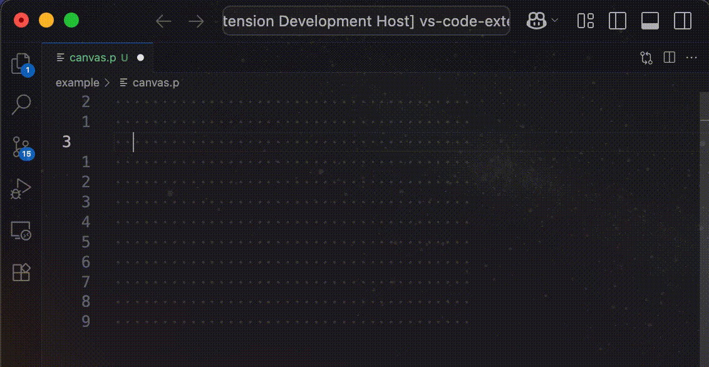

# README

Draw Lines using standard unicode characters within VS Code!

## Features

Draw Lines using standard unicode characters within VS Code!

## How To Use

To begin, open a text file with sufficient empty whitespace. This is Your canvas.

1. Enter the `Start Drawing` command (default shortcut is Ctrl+Shift+D).
2. Use the arrow keys to draw a single contiguous path.
3. When done, use `Exit Drawing Mode` (Escape) to exit drawing mode

## Requirements

Minimum VS Code version is 1.101 because extension compiler will yell at me otherwise.

## Extension Settings

No settings

## Known Issues

### Compatibility

Vim: 

 - If You have the Vim extension installed and active, but toggled off, entering drawMode will cause You to enter Vim mode at the same time and line drawing won't work correctly.

## Release Notes

See [CHANGELOG.md](CHANGELOG.md) for notes